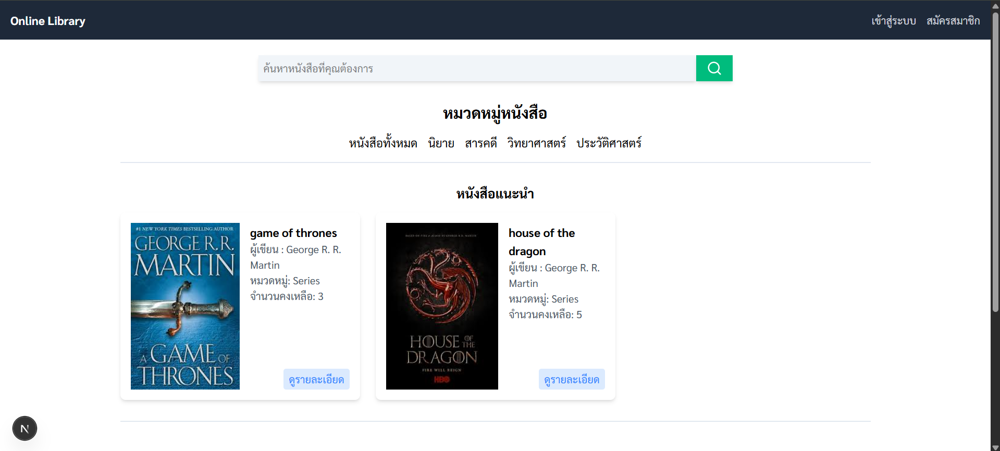

## Online Library (ยังไม่เสร็จสมบูรณ์)

## Preview (กำลังทำ)


## Technology
 - Next.js
 - MongoDB

## schema
users
```
{
  "_id": ObjectId,
  "name": "Somchai Jaidee",
  "email": "somchai@example.com",
  "password": "hashed_password",
  "role": "user", // or "admin"
  "createdAt": ISODate,
  "updatedAt": ISODate
}
```

books
```
{
  "_id": ObjectId,
  "title": "Clean Code",
  "author": "Robert C. Martin",
  "category": "Programming",
  "isbn": "9780132350884",
  "stock": 5,
  "coverUrl": "https://example.com/cleancode.jpg",
  "createdAt": ISODate,
  "updatedAt": ISODate
}
```

borrows
```
{
  "_id": ObjectId,
  "userId": ObjectId("ref users"),
  "bookId": ObjectId("ref books"),
  "borrowDate": ISODate,
  "returnDate": null, // filled when returned
  "status": "borrowed" // borrowed | returned
}
```

## Structure
```
/app
  /auth
    /login
    /register
  /books
    /page.tsx          -> list books
    /[id]/page.tsx     -> book detail
  /admin
    /books/page.tsx    -> CRUD books
    /dashboard/page.tsx
  /borrow
    /page.tsx          -> user borrow history
/lib
  db.ts                -> connect MongoDB
/models
  User.ts
  Book.ts
  Borrow.ts
/api
  /auth/login
  /auth/register
  /books
  /borrow
```